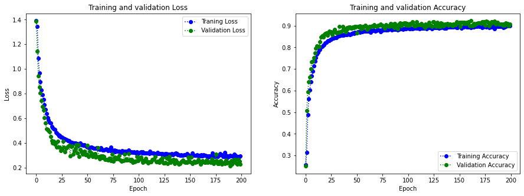
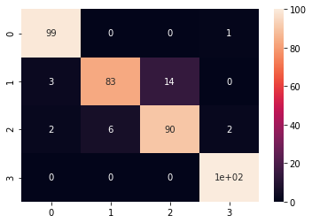

# COVID-Image-Diagnosis-Tool

<p align="center">
  
</p>

## Project Overview

This project focuses on the classification of COVID-19 cases using radiography images. Leveraging convolutional neural networks (CNNs), the model is trained to identify patterns indicative of COVID-19 in chest radiographs.

## Table of Contents

- [Dataset](#dataset)
- [Installation](#installation)
- [Usage](#usage)
- [Data Preprocessing](#data-preprocessing)
- [Model Architecture](#model-architecture)
- [Training](#training)
- [Evaluation](#evaluation)
- [Results](#results)
- [Future Enhancements](#future-enhancements)
- [Contributing](#contributing)

## Dataset

The dataset used in this project is the [COVID-19 Radiography Database](https://www.kaggle.com/tawsifurrahman/covid19-radiography-database) obtained from Kaggle.

## Installation

1. Clone the repository:

```bash
git clone https://github.com/matlaczj/COVID-Image-Diagnosis-Tool
```

2. Install dependencies:

```bash
conda env create -f environment.yml
conda activate covid_classification
```

## Usage

1. Navigate to the project directory:

```bash
cd COVID-Image-Diagnosis-Tool
```

2. Run the main script:

```bash
src\code.ipynb
```

## Data Preprocessing

The dataset undergoes preprocessing steps, including resizing images, converting to grayscale, and normalizing pixel values. Class imbalance is addressed through class weights.

## Model Architecture

The model architecture consists of convolutional layers with decreasing kernel sizes. Dropout is applied to mitigate overfitting.

## Training

The model is trained using Adam optimizer with standard learning rates. Callbacks for early stopping and monitoring metrics like precision and recall are utilized.


 

## Evaluation

Evaluation metrics, including accuracy and confusion matrices, are computed on both validation and test sets.

## Results

Various scores and confusion matrices provide insights into classification performance.


 

## Future Enhancements

- Incorporate data augmentation techniques (rotations, flips) to enhance dataset diversity.
- Implement early stopping based on recall/precision.
- Add F1 score plots for individual classes.

## Contributing

Contributions are welcome! Feel free to open issues or submit pull requests.